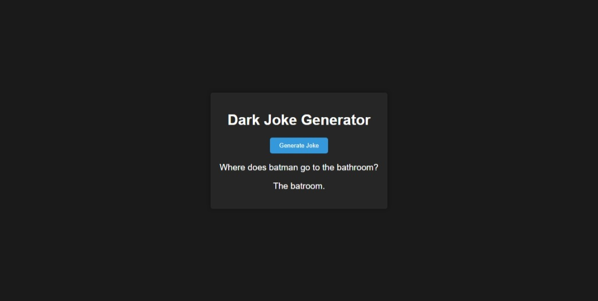

# Joke Generator



## Table of Contents
- [About](#about)
- [Features](#features)
- [Getting Started](#getting-started)
  - [Prerequisites](#prerequisites)
  - [Installation](#installation)
- [Usage](#usage)
- [License](#license)
- [Acknowledgments](#acknowledgments)

## About
The Joke Generator is a simple web application that generates random jokes for a good laugh. It's designed to provide a quick dose of humor whenever you need it. This repository contains the source code for the Joke Generator.

## Features
- Random Joke Generation: Click the "Generate Joke" button to get a random joke.
- Joke Categories: Choose from different joke categories for a specific type of joke.
- Easy to Use: The user-friendly interface makes it simple to get a laugh.

## Getting Started
### Prerequisites
- A web browser to run the application.

### Installation
1. Clone the repository:

   ```bash
   git clone https://github.com/Anuj3366/Joke-Generator.git
   ```

2. Open the `index.html` file in your web browser to run the Joke Generator.

## Usage
1. Open the Joke Generator in your web browser.
2. Click the "Generate Joke" button to get a random joke.
3. Use the category dropdown to select a specific type of joke.

## License
This project was made and designed by Anuj Garg, and he holds all the rights to it.

## Acknowledgments
Have a good laugh with the Joke Generator!
